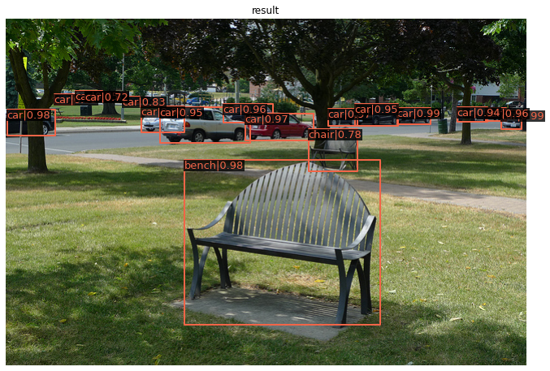
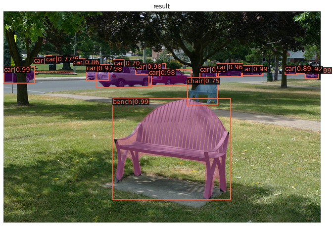

[](https://colab.research.google.com/github/saliton/MMDetection/blob/main/mmdet.ipynb)

# Google Colabで物体認識を簡単に試す

物体認識をpytorchで行う[MMDetection](https://github.com/open-mmlab/mmdetection)というライブラリが公開されています。今回、学習済みモデルを使ってこの物体認識をGoogle Colabで実行してみます。

まずはColabのランタイムのタイプをGPUに変更してください。
次にpipでライブラリをインストールします。ライブラリの名前はmmdetです。


```shell
!pip install mmdet
```

    Collecting mmdet
    [?25l  Downloading https://files.pythonhosted.org/packages/b9/45/07f0af04dcba6532fdfa424e2b1f997606feded253524c821f6e94a16ba8/mmdet-2.11.0-py3-none-any.whl (559kB)
         |████████████████████████████████| 563kB 27.3MB/s 
    [?25hRequirement already satisfied: six in /usr/local/lib/python3.7/dist-packages (from mmdet) (1.15.0)
    Requirement already satisfied: matplotlib in /usr/local/lib/python3.7/dist-packages (from mmdet) (3.2.2)
    Collecting mmpycocotools
      Downloading https://files.pythonhosted.org/packages/99/51/1bc1d79f296347eeb2d1a2e0606885ab1e4682833bf275fd39c189952e26/mmpycocotools-12.0.3.tar.gz
    Requirement already satisfied: numpy in /usr/local/lib/python3.7/dist-packages (from mmdet) (1.19.5)
    Collecting terminaltables
      Downloading https://files.pythonhosted.org/packages/9b/c4/4a21174f32f8a7e1104798c445dacdc1d4df86f2f26722767034e4de4bff/terminaltables-3.1.0.tar.gz
    Requirement already satisfied: cycler>=0.10 in /usr/local/lib/python3.7/dist-packages (from matplotlib->mmdet) (0.10.0)
    Requirement already satisfied: python-dateutil>=2.1 in /usr/local/lib/python3.7/dist-packages (from matplotlib->mmdet) (2.8.1)
    Requirement already satisfied: pyparsing!=2.0.4,!=2.1.2,!=2.1.6,>=2.0.1 in /usr/local/lib/python3.7/dist-packages (from matplotlib->mmdet) (2.4.7)
    Requirement already satisfied: kiwisolver>=1.0.1 in /usr/local/lib/python3.7/dist-packages (from matplotlib->mmdet) (1.3.1)
    Requirement already satisfied: setuptools>=18.0 in /usr/local/lib/python3.7/dist-packages (from mmpycocotools->mmdet) (54.2.0)
    Requirement already satisfied: cython>=0.27.3 in /usr/local/lib/python3.7/dist-packages (from mmpycocotools->mmdet) (0.29.22)
    Building wheels for collected packages: mmpycocotools, terminaltables
      Building wheel for mmpycocotools (setup.py) ... [?25l[?25hdone
      Created wheel for mmpycocotools: filename=mmpycocotools-12.0.3-cp37-cp37m-linux_x86_64.whl size=264260 sha256=4f4dd3efdd92aaf4f949955ad912a1d141d4f00f1890740e376e49dd503aa498
      Stored in directory: /root/.cache/pip/wheels/a2/b0/8d/3307912785a42bc80f673946fac676d5c596eee537af7a599c
      Building wheel for terminaltables (setup.py) ... [?25l[?25hdone
      Created wheel for terminaltables: filename=terminaltables-3.1.0-cp37-none-any.whl size=15356 sha256=a259f3f1041ab5c3496360efd193e536be05f403f7fe81162d01387627ca566a
      Stored in directory: /root/.cache/pip/wheels/30/6b/50/6c75775b681fb36cdfac7f19799888ef9d8813aff9e379663e
    Successfully built mmpycocotools terminaltables
    Installing collected packages: mmpycocotools, terminaltables, mmdet
    Successfully installed mmdet-2.11.0 mmpycocotools-12.0.3 terminaltables-3.1.0


簡単にインストールできました。ライブラリをimportしましょう。


```python
import mmdet
```


    ---------------------------------------------------------------------------

    ModuleNotFoundError                       Traceback (most recent call last)

    <ipython-input-2-38ab3d8819c4> in <module>()
    ----> 1 import mmdet
    

    /usr/local/lib/python3.7/dist-packages/mmdet/__init__.py in <module>()
    ----> 1 import mmcv
          2 
          3 from .version import __version__, short_version
          4 
          5 


    ModuleNotFoundError: No module named 'mmcv'

    

    ---------------------------------------------------------------------------
    NOTE: If your import is failing due to a missing package, you can
    manually install dependencies using either !pip or !apt.
    
    To view examples of installing some common dependencies, click the
    "Open Examples" button below.
    ---------------------------------------------------------------------------


駄目です。ライブラリの依存関係の設定に不備があるようです。というわけで、mmcvをインストールするのですが、実はmmcvでは上手くいきません。mmcv-fullが必要です。

mmcv-fullのインストールには時間がかかります。


```shell
%%time
!pip install mmcv-full
```

    Collecting mmcv-full
      Using cached https://files.pythonhosted.org/packages/25/bd/f47992449359ed0d403a84d5228195b8f12e7e99181e1e45acab6e966627/mmcv-full-1.3.1.tar.gz
    Collecting addict
      Using cached https://files.pythonhosted.org/packages/6a/00/b08f23b7d7e1e14ce01419a467b583edbb93c6cdb8654e54a9cc579cd61f/addict-2.4.0-py3-none-any.whl
    Requirement already satisfied: numpy in /usr/local/lib/python3.7/dist-packages (from mmcv-full) (1.19.5)
    Requirement already satisfied: Pillow in /usr/local/lib/python3.7/dist-packages (from mmcv-full) (7.1.2)
    Requirement already satisfied: pyyaml in /usr/local/lib/python3.7/dist-packages (from mmcv-full) (3.13)
    Collecting yapf
      Using cached https://files.pythonhosted.org/packages/5f/0d/8814e79eb865eab42d95023b58b650d01dec6f8ea87fc9260978b1bf2167/yapf-0.31.0-py2.py3-none-any.whl
    Building wheels for collected packages: mmcv-full
      Building wheel for mmcv-full (setup.py) ... [?25l[?25hdone
      Created wheel for mmcv-full: filename=mmcv_full-1.3.1-cp37-cp37m-linux_x86_64.whl size=22542286 sha256=82a483af17411c275ede9b0cd4e76dd1d62d4448bbbf2b6b8d480f3dec3c8b8f
      Stored in directory: /root/.cache/pip/wheels/75/40/57/0825abf01599edf55ba2a23444af249e79205dc0572786418d
    Successfully built mmcv-full
    Installing collected packages: addict, yapf, mmcv-full
    Successfully installed addict-2.4.0 mmcv-full-1.3.1 yapf-0.31.0
    CPU times: user 2.66 s, sys: 290 ms, total: 2.95 s
    Wall time: 10min 51s


それでは改めてmmdetをインポートします。


```python
import mmdet
```

できました。

次に学習済みモデルを取得します。[MMDetection](https://github.com/open-mmlab/mmdetection)のページに様々なモデルが載っています。今回はfaster_rcnnを使いましょう。リンクを辿り、学習済みモデルのURLを調べて、wgetでファイルを取得します。


```shell
# Faster R-CNN
!wget -P /content https://open-mmlab.s3.ap-northeast-2.amazonaws.com/mmdetection/v2.0/faster_rcnn/faster_rcnn_r50_fpn_1x_coco/faster_rcnn_r50_fpn_1x_coco_20200130-047c8118.pth
```

    --2021-04-22 05:48:46--  https://open-mmlab.s3.ap-northeast-2.amazonaws.com/mmdetection/v2.0/faster_rcnn/faster_rcnn_r50_fpn_1x_coco/faster_rcnn_r50_fpn_1x_coco_20200130-047c8118.pth
    Resolving open-mmlab.s3.ap-northeast-2.amazonaws.com (open-mmlab.s3.ap-northeast-2.amazonaws.com)... 52.219.60.111
    Connecting to open-mmlab.s3.ap-northeast-2.amazonaws.com (open-mmlab.s3.ap-northeast-2.amazonaws.com)|52.219.60.111|:443... connected.
    HTTP request sent, awaiting response... 200 OK
    Length: 167287506 (160M) [application/x-www-form-urlencoded]
    Saving to: ‘faster_rcnn_r50_fpn_1x_coco_20200130-047c8118.pth’
    
    faster_rcnn_r50_fpn 100%[===================>] 159.54M  16.4MB/s    in 11s     
    
    2021-04-22 05:48:58 (14.4 MB/s) - ‘faster_rcnn_r50_fpn_1x_coco_20200130-047c8118.pth’ saved [167287506/167287506]
    


次に必要なモジュールをimportします。


```python
from mmdet.apis.inference import init_detector, inference_detector, show_result_pyplot
```

importできました。しかしここで困った事態に。init_detector()の引数にはconfigファイルと重みファイルを指定します。重みファイルは先ほど取得しました。ではconfigファイルは？同様にURLを指定して取得しようとしましたが、configファイルは単一ファイルではなく、複数必要でした。結局、ソースをまるごと取得したほうが簡単ですので、取得しましょう。


```shell
!git clone https://github.com/open-mmlab/mmdetection.git
%cd /content/mmdetection
```

    Cloning into 'mmdetection'...
    remote: Enumerating objects: 17031, done.
    remote: Counting objects: 100% (223/223), done.
    remote: Compressing objects: 100% (174/174), done.
    remote: Total 17031 (delta 90), reused 122 (delta 48), pack-reused 16808
    Receiving objects: 100% (17031/17031), 20.43 MiB | 34.69 MiB/s, done.
    Resolving deltas: 100% (11757/11757), done.
    /content/mmdetection


ソースの中のconfigファイルと先に取得した重みファイルを指定してモデルを作成します。deviceには'cuda:0'を指定します。


```python
model = init_detector('configs/faster_rcnn/faster_rcnn_r50_fpn_1x_coco.py', '/content/faster_rcnn_r50_fpn_1x_coco_20200130-047c8118.pth', device='cuda:0')
```

    Use load_from_local loader


ソースの中の画像を利用して物体認識を実行し、結果を表示します。


```python
result = inference_detector(model, "demo/demo.jpg")
show_result_pyplot(model, "demo/demo.jpg", result, score_thr=0.7)
```

    /usr/local/lib/python3.7/dist-packages/mmdet/datasets/utils.py:68: UserWarning: "ImageToTensor" pipeline is replaced by "DefaultFormatBundle" for batch inference. It is recommended to manually replace it in the test data pipeline in your config file.
      'data pipeline in your config file.', UserWarning)


あっさり成功しました。でもWarningが出ていて格好悪いです。本来、警告に従って修正すべきですが、面倒なので上辺だけ取り繕います。


```python
import warnings
warnings.simplefilter('ignore')
result = inference_detector(model, "demo/demo.jpg")
show_result_pyplot(model, "demo/demo.jpg", result, score_thr=0.7)
```





次にMask R-CNNを試しましょう。こちらは物体の位置だけでなく、その領域も認識してくれます。

まずは学習済みの重みファイルを取得します。


```python
# Mask R-CNN
!wget -P /content http://download.openmmlab.com/mmdetection/v2.0/mask_rcnn/mask_rcnn_r50_fpn_1x_coco/mask_rcnn_r50_fpn_1x_coco_20200205-d4b0c5d6.pth
```

    --2021-04-22 06:22:12--  http://download.openmmlab.com/mmdetection/v2.0/mask_rcnn/mask_rcnn_r50_fpn_1x_coco/mask_rcnn_r50_fpn_1x_coco_20200205-d4b0c5d6.pth
    Resolving download.openmmlab.com (download.openmmlab.com)... 47.252.96.35
    Connecting to download.openmmlab.com (download.openmmlab.com)|47.252.96.35|:80... connected.
    HTTP request sent, awaiting response... 200 OK
    Length: 177862517 (170M) [application/octet-stream]
    Saving to: ‘/content/mask_rcnn_r50_fpn_1x_coco_20200205-d4b0c5d6.pth’
    
    mask_rcnn_r50_fpn_1 100%[===================>] 169.62M  9.07MB/s    in 19s     
    
    2021-04-22 06:22:32 (8.95 MB/s) - ‘/content/mask_rcnn_r50_fpn_1x_coco_20200205-d4b0c5d6.pth’ saved [177862517/177862517]
    


次にモデルの作成と認識実行です。


```python
model = init_detector("configs/mask_rcnn/mask_rcnn_r50_fpn_1x_coco.py", "/content/mask_rcnn_r50_fpn_1x_coco_20200205-d4b0c5d6.pth", device="cuda:0")
result = inference_detector(model, "demo/demo.jpg")
show_result_pyplot(model, "demo/demo.jpg", result, score_thr=0.7)
```

    Use load_from_local loader





驚くほど簡単に実行できました。

[MMDetection](https://github.com/open-mmlab/mmdetection)には他にもたくさんのモデルが公開されています。どれも今回の記事と同じ方法で実行できますので、試してみてはいかがでしょうか。

